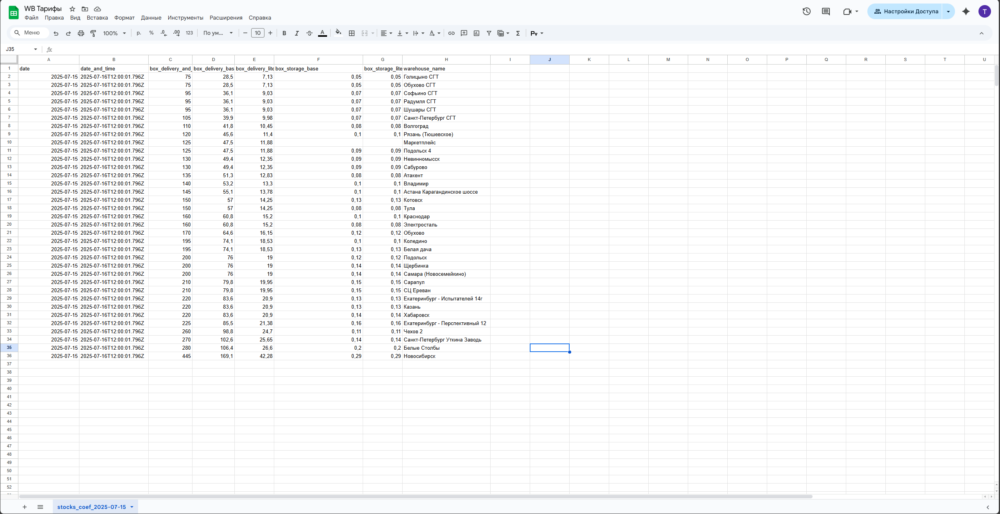

# Данное решение - это MVP сервис, который реализует логику обращения по расписанию к маркетплейсу Wildberries через заданный Endpoint, получает и ежечасно (в начале каждого часа: 19.00 -> 20.00 -> 21.00 ...) накапливает в базе данных информацию, получаемую по api, и выдает ее в google-таблице.

# Установка и запуск
1. **Клонируйте репозиторий:**

```bash
git clone https://github.com/Teimur579/wb-tariffs-service.git
cd wb-tariffs-service
```

2. **Создайте файл .env на основе шаблона:**

```bash
cp .env.example .env
```
Заполните файл .env своими значениями (ключи доступа к БД и Google API).

3. **Запустите проект через Docker Compose:**

```bash
docker compose -f 'docker-compose.yaml' up -d --build
```

***После сборки:***

*-сервер будет доступен на http://localhost:3000*
*-PostgreSQL поднимется в контейнере и автоматически применятся миграции*

# Пример выгрузки данных в spreadsheet
